---
1.本文档假定你已经在机器上安装了jdk1.8和maven；
2.maven配置私有仓库方法，参照《maven配置私有仓库指南》--by 田楠。
---

###  cf-service项目说明

#### 一、结构

+ sp-patrol: 单独的服务包

+ patrol-object: 服务对应的业务实现

+ pom.xml: 基础依赖，具体服务包会继承这个pom的依赖，不要重复引用

  > 环境统一使用IntelliJ IDEA 作为开发工具；
  > 服务包和业务实现包以子项目形式存在。


#### 二、子项目的结构

#### 2.1 命名规范

* 服务包以`sp-`开头，如`sp-patrol`；
* 服务实现包以`-object`结尾，如`patrol-patrol`;
* 服务包的基础报名前缀为`com.zzht.service.xxxx`；
* 业务实现包的报名前缀为`com.zzht.component.xxxx`;

示例代码：

```java
//#1.服务包
pakacge com.zzht.service.patrol.common;
//......
//....

// #2.实现包
pakacge com.zzht.service.patrol.webservice
//....
//....

```

#### 2.2 sp服务包代码结构

```markdown
## main
- common  			公共部分
	- ServiceCore	实现IService，，用来secore发布服务
- contanst			常量等基本定义
- exception			异常或者返回的消息定义
- webservice		        服务接口
	-restful		服务接口restful
	-soap			服务接口soap
## resource
- Service.xml			服务发布依赖的bean
- Service-REST-http.xml	 REST服务地址绑定
- Service-SOAP-http.xml  SOAP服务地址绑定
```

#### 2.3 object实现包结构

``` markdown
## main
- api			jdk级别的API调用，包含逻辑实现层
- common		公共部分抽离
- dao			数据访问层
- entity		实体类
- exception	自定义异常
## resource
- sqlmaps				mybaties数据访问配置文件目录
	- XxxxMapper.xml	mapper配置
- sprig-mabaties.xml	mybaties与spring集成配置
```


#### 2.4 maven打包使用

```
mvn clean install:将打包的jar添加到仓库（本地）
mvn clean package: 打包
```

#### 2.5 TOMCAT 8.x 本地调试环境配置
```markdown
[此部分主要用于指导TOMCAT 8.x 环境下的本地调试环境配置，需以截图和实际的环境相结合]
## 环境 
Windows 10
JDK 1.8
Tomcat 8.0
前置条件，在调试运行项目之前需要了解基础的CityServer基础知识，准备基础运行环境和配置文件，[后续会上传基础配置文件]
##
[PREPARE] 
配置ServiceEngine的web.xml, 需要配置MyBatis配置文件和筛选器，如下图
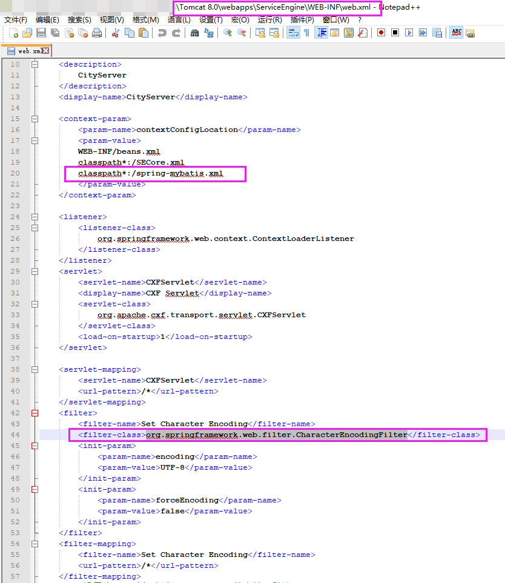 
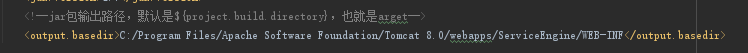 


**[STEP1]**
IDEA调试工具栏中编辑调试配置，选择Edit Configurations
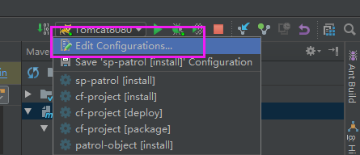 

**[STEP2]**
选择Tomcat Server，点击绿色 **+** 号
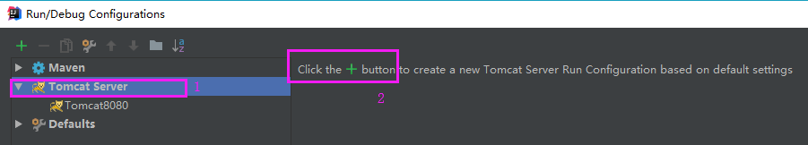 

**[STEP3]**
Tomcat IDEA下有 local 和 remote 两种模式，选择local 
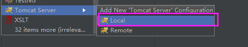 

**[STEP4]**
添加一个新的Tomcat Server 名称，添加Deployment，选择Artifact,然后按照下列截图配置相关的参数
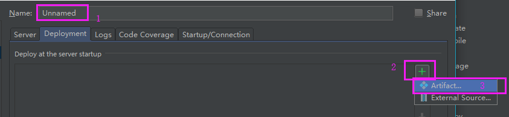 
 
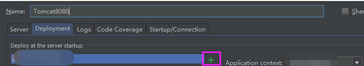 
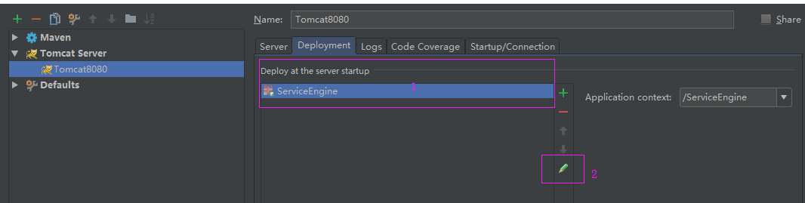 
将相应的模块输出到指定的目录下，（项目的pom.xml中已经指定了lib输出路径，这里只需输出或复制自己所需的内容）
由于service不是默认的webservice目录，所以需要将自己的服务复制到对应的目录
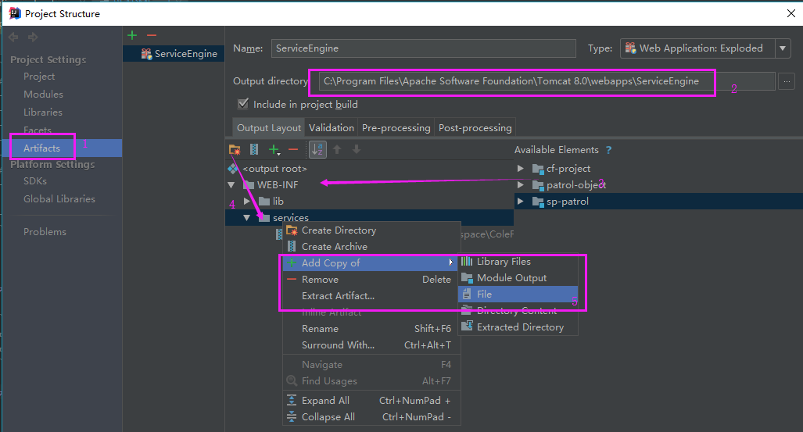 
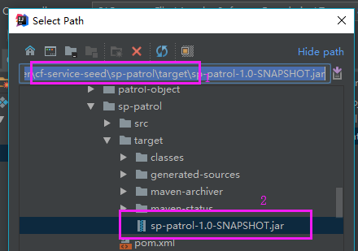 


**[STEP5]**
填写Application Context，目前约定使用ServiceEngine
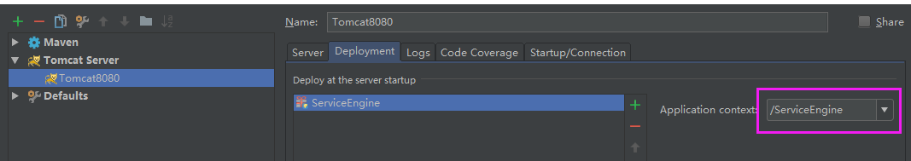 

**[STEP6]**
在调试选项的下拉项中选择我们刚添加的服务
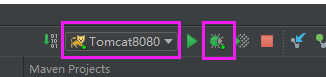 

**[STEP7]**
配置数据库路径，启动服务，服务启动成功后在浏览器输入
[](http://localhost:8080/ServiceEngine/restful/person/queryPerson)
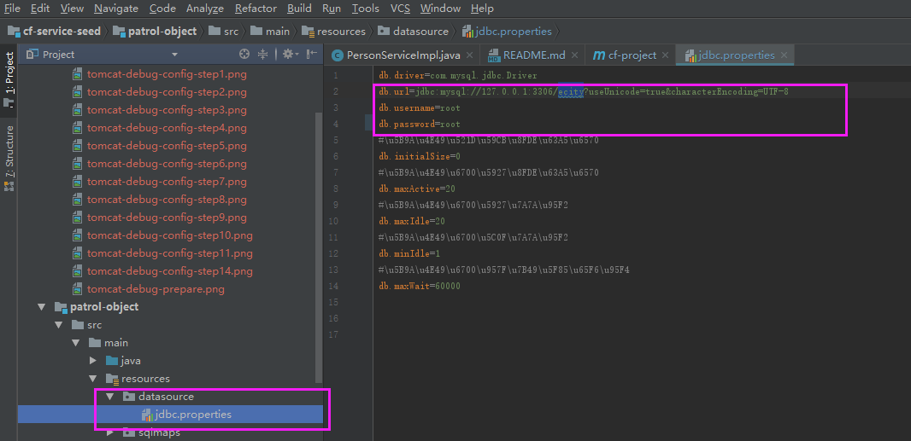 
 

之后有代码修改时，只需要mvn install ，不必要再次重启tomcat
```
